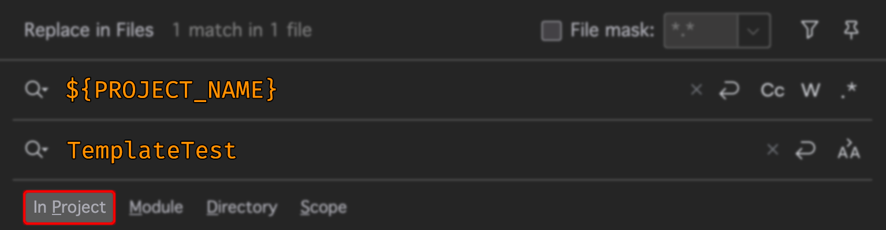

# GraalVM IntelliJ Headless Project Template

## Must Be Done First!

Immediately AFTER creating a new project with this template, before doing anything else, you need to do a GLOBAL search and replace across all of the files in the project (On my mac, this is done by pressing `Command+Shift+R` then search for these strings and replace them with the correct string

Search for:

```Java
${PROJECT_NAME}
${PACKAGE_NAME}
```

And replce with the correct text. For example, if my project is named `MyProject` I would do the global search for `${PROJECT_NAME}` and replace with `MyProject` then click the `Replace All` button.

And if my package root is `com.simtechdata`, then I would globally search `${PACKAGE_NAME}` and replace with `com.simtechdata` then click on `Replace All`

Once that is done ...

When you are ready to compile the project into a native image, use the command line and change into the `compile` folder and then move the scripts from one of the sub-folders into the compile folder.

There are two scripts in there for doing just that. If you're using Windows, just run `setwin.bat`. If you're in MacOS or Linux, run this:

```bash
chmod +x setnix.sh;./setnix.sh;
```

You cannot run the scripts from the sub folders (nix and win) as they will not work from those locations because they rely on the parent folder being the project root folder.

Here is a breakdown of what each script / batch file does:

|Script| Description                                                                                                                                                                                                                                                                                                                                                                                                                                                                                                                   |
|------|-------------------------------------------------------------------------------------------------------------------------------------------------------------------------------------------------------------------------------------------------------------------------------------------------------------------------------------------------------------------------------------------------------------------------------------------------------------------------------------------------------------------------------|
|compile| Compiles the project into a fat jar that lands in the `target` folder.                                                                                                                                                                                                                                                                                                                                                                                                                                                        |
|dograal| This script uses the native-image ability to inspect the project as it is running in memory in order to determine all uses of reflection within your code. Including reflection uses that might be happening in any dependencies that you utilize. It then will write out a JSON file that the GraalVM native image compiler uses to ensure that reflection works properly in the compiled native image. Graal has implemented this feature into the `java` command itself. This is why it is important to use a GraalVM JDK. |
|manualNative| This script is only for testing native-image command line arguments that you can then implement into the POM file (explained below).                                                                                                                                                                                                                                                                                                                                                                                          |
|native| Compiles the project into the final native image. It drops the artifact into the project root / `native-image` folder. Make sure you have created the .json file by running the dograal script first. Also it is not necessary to run the dograal script every time you make a change to the code. Unless your change introduces new dependencies or makes calls to new classes that you had not previously made calls to.                                                                                                    |
|runjar| Runs the jar file that is generated by the `compile` script and it will pass in any arguments that you add in the command line.                                                                                                                                                                                                                                                                                                                                                                                               |
|runjarG| Lets you run the jar with any arguments you wish to use, where it also adds the reflection detection into the json file. Useful adding reflection instances in one-off scenarios. Make sure you run the `compile` script before using this.|

For example using the `runjar` script:

Doing this:

```Bash
runjar --version
runjar --option1 --option2
```

Will run this:

```BASH    
java -jar MyProject-jar-with-dependencies.jar --version
java -jar MyProject-jar-with-dependencies.jar --option1 --option2
```

## Installing The Template
You have two options:

1) Clone this repository and open the project in IntelliJ - DO NOT EDIT ANYTHING, then click on `File` / `New Projects Setup` / `Save Project As Template`
2) [Download the zip file](https://github.com/EasyG0ing1/GraalVM_Headless_Native_Image_Template/releases/latest) and place it into your `projectTemplates` folder:

Here are the typical default locations for that folder for each OS:

```bash
Mac:     ~/Library/Application Support/JetBrains/IntelliJIdea[version]/projectTemplates
Linux:   ~/.config/JetBrains/IntelliJIdea[version]/projectTemplates
Windows: C:\Users\<YourUsername>\AppData\Roaming\JetBrains\IntelliJIdea[version]\projectTemplates
```

### Version discussion

I use GraalVM version 25 and Maven version 4.0.0-rc-3. Here is the output of `mvn --version` on my machine:

```BASH
Picked up JAVA_TOOL_OPTIONS: -Dapple.awt.enableTemplateImage=false
Apache Maven 4.0.0-rc-3 (3952d00ce65df6753b63a51e86b1f626c55a8df2)
Maven home: /Users/michael/.sdkman/candidates/maven/4.0.0-rc-3
Java version: 25, vendor: Oracle Corporation, runtime: /Users/michael/.sdkman/candidates/java/25.ea.20-graal
Default locale: en_US, platform encoding: UTF-8
OS name: "mac os x", version: "15.4", arch: "x86_64", family: "mac"
```
No guarantees with older versions ... the POM file specifically uses native image arguments which are only recognized by the GraalVM 25 JDK.

## JDK Management

I HIGHLY recommend using [SDKMan](https://sdkman.io/) to manage your development environment. It is much more than a simple JDK manager, it also manages a lot of other tools that developers use. I primarily use it to manage my JDKs as well as my Maven environment. It is very simple to both download and install a large variety of JDKs then switch to them on the fly as needed.

These are the [JDKs](https://sdkman.io/jdks) and [SDKs](https://sdkman.io/sdks) that SDKMan can manage

Sadly, I don't believe there is a Windows version of SDKMan and after doing a little poking around, it looks like [jabba](https://github.com/shyiko/jabba) might do the trick.

# Build Environment Setup
Each OS will need different pre-requisites installed.

- [Linux / MacOS](docs/LinuxMacBuildEnvironment.md)
- [Windows](docs/WindowsBuildEnvironment.md)

Without those items installed, you will not be able to compile the project into a native image.

# POM File Discussion

## Properties

This is where I store the version numbers of both dependencies and plugins. I wouldn't say that the POM file is any easier or harder to manage this way, but ive read that it's the most correct way to handle version numbers. I preface tags with the word `version` because on overview glance, it makes it easy to spot a tag that is intended as a version number.

## Dependencies

The only dependency here is [picocli](https://picocli.info) (pronounced: Pico CLI) which is a great library for implementing industry standard command line argument syntax into your code, which is what that project is deeply committed to. The library is very powerful and can do much more than just what is in this template. I included usage examples of what would most likely be your most often use cases (booleans, Strings etc.).

# Build Section

## Version File

Maven uses the `version.properties` file in the resources folder when the project is packaged where it will place the version number of the project into that file. Then, at run time, the code will correctly use that file to display the version number when the --version argument is passed into the executable. So, all you need to do is update the version number in the pom file and the rest is handled auto-magically ... nice and easy if you ask me.

But this then requires a little explanation of this part of the pom file in the build section:

```XML
<resources>
    <resource>
        <directory>src/main/resources</directory>
        <filtering>true</filtering>
        <includes>
            <include>version.properties</include>
        </includes>
    </resource>
    <resource>
        <directory>src/main/resources</directory>
        <filtering>false</filtering>
        <includes>
            <include>META-INF/native-image/${groupId}/${project.name}/*.*</include>
        </includes>
    </resource>
</resources>
```

The way this works is that we filter specific files (`version.properties` in this case), by defining them within a `<resource>` tag, where we set `<filtering>` to true. Maven will then modify any files within that resource definition. However, this means that it then becomes important to make sure you exclude any other files that you don't want Maven to touch, which is why the second resource section exists. It tells Maven to not touch the files listed within its `<includes>` section (notice we set filtering in that resource to false).

In the past, when I did not have that second resource defined, any other files that I had in the resources folder ended up getting modified and corrupted in the packaging phase. It even corrupted binary files like image files when they were not listed in the not-filtered resource.

### Versions Maven Plugin

This plugin is very handy for keeping the versions of your dependencies and plugins up to date. The way I use it is in IntelliJ, I expand the Maven tool (right side of the screen) then drill down to the versions plugin then I run the `display-dependency-updates` and the `display-plugin-updates` configurations where it then spits out any version numbers that need to be changed and provides the latest version number. There are ways to use the plugin to keep the version numbers updated automatically but I've not used it for that because I like to do those changes myself.

### Version Maven Enforcer Plugin

This is probably not all that necessary, but I got into the habit of keeping it in my projects. It really just ensures that when you run maven, that the version of maven you're running is the version you specify in the plugin.

### Maven Assembly Plugin

This plugin has become essential to successfully generating a graalVM native image in my experience. What I like about it, is that it creates a fat jar file that has ALL the dependency .jar files wrapped into a single jar file, making the whole process of locating, then stating all of the class paths - moot. I like to append the text 'jar-with-dependencies' to the name of the jar file because the default name that it gives uses the version number of the project, and this makes the usage of the compile scripts difficult to manage since we would need to change the script every time we change the projects version number, so I decided to have it hard code the name so it remains static across version number changes.

## Profile Section

### Version Native Maven Plugin

This plugin is made by the GraalVM team. It's made the process of making a native image super easy through the exploitation of the Maven ecosphere. But it essentially just lets you set up the native image command with the parameters that you need to build the native image. It automatically figures out that we built a fat jar with the Assembly plugin and it uses it automatically to generate our native image.

In most cases, the only thing you might need to change are the different arguments in the `<arg>` list. I use the `manualNative.sh` script to test my command line arguments and when I get a successful build, I make sure those arguments are included in the pom file.

The only time you will be messing with this is when you have issues with different dependencies in your projects where there might be a need to make changes so that they work properly in your final native image.

When a native image will not run, throwing some kind of error, where it will run as a jar file, and I know I've run the `dograal` script, I will copy the error output and give it to ChatGPT where it generally does a good job of quickly synthesizing the error and explaining what the problem is AND what to change in your POM file to get it to work properly.

In fact, you can zip up your entire project and give it to ChatGPT and ask it to thoroughly analyze your project (which will have the json file from your dograal script output AND your POM file). You simply instruct it to analyze the project in context with `pom.xml` and `reachabililty-metadata.json`, and tell it to cross reference those files with every class in your project and to verify that those files are properly configured to produce a working native-image and to instruct you on what to change to make the native-image work and most of the time, I get very useful feedback and am back on the road rather quickly.

ChatGPT is becomming a very powerful tool towards saving time in Java development.

## Usage Steps

To use the template, or even to test it, follow these steps:

1) Create a new project based on the template. In the new project window, Select the template, then give the project a name (like TemplateTest) and fill in the Base package (I use com.simtechdata for example).
2) Do a global search and replace (`Shift-Alt-R`) for `${PROJCT_NAME}` and replace it with the project name (TemplateTest), click on `Replace All`. Your search dialogue should look similar to this where `In Project` is set as the scope.

[]()

3) Do a global search and replace for `${PACKAGE_NAME}` and replace it with the base package name (com.simtechdata), click on `Replace All`
4) Get to a command prompt (I do this in IntelliJ via `ALT+F12`)
5) Change into the `project root/compile` folder
6) Execute the set script (Windows: `runjar.bat` and MacOS/Linux: `chmod +x setnix.sh;./setnix.sh`)
7) run the `dograal` script (Windows: `dograal.bat` and MacOS/Linux `./dograal.sh`)
8) Compile the native image (Windows: `native.bat` and MacOS/Linux `./native.sh`) - This will take a while, but it provides plenty of feedback as it works.
9) Run the native image: `../native-image/TemplateTest -h`

Viola! You now have a working native image!

### Some thoughts on GraalVM

GraalVM is a HEAVY project that dives about as deep into Java as any project I've ever seen. It takes Java code and manages to get it to compile with C compilers into native code that is more efficient than using the JVM.

As you can imagine, getting a deep understanding of how GraalVM works is a very ambitious endeavor, and I would tend to think that no one would have the time to do so unless your full time job is compiling Java projects into native images.

I've been working with GraalVM for a couple of years now and though I've learned a lot, I have not even scratched the surface. I rely on ChatGPT to help me navigate problems that I encounter with graal, and it has proven to be a valuable resource to that end.

In short, most of the issues that you will face, will most likely be in relation to some library that you're using that doesn't play nice with Graal. But ultimately, I can sum up the solution to almost all of the problems I've run into as being a solution rooted in figuring out how to modify the `reachability-metadata.json` file so that it correctly understands how reflection is working in the code. And aside from that, it has been a matter of figuring out the correct command line arguments for the native-image compiler, or sometimes its about figuring out which maven plugin I might need to use in order to make things work.

Initially, I struggled a lot with class paths and getting dependency modules included in the build until I discovered this fat jar method (which does not always work with JavaFX by the way).

If you run into any issues, I would be happy to discuss them with you, if I can be of any help at all. I still consider myself fairly green when it comes to GraalVM, but with this template, I have been able to consistently kick out native image after native image where I never have any issues at all, and that has been a nice change of pace.

So, I hope you get some use out of this template as I have for some time now.

### JavaFX

This template is pretty much useless for JavaFX projects. I have a different project template for those but it still needs some refinement. GraalVM does not generally do well compiling JavaFX into native-images but it can be done with some tweaking, though that process is sometimes very time consuming and tedious depending on the complexity of the project.

### Comments / Issues

Feel free to create an issue to have any discussions with me about any aspect of this template.

Happy Coding!
